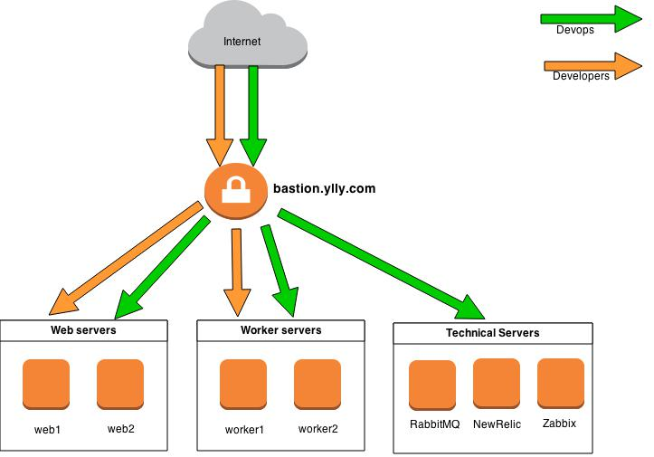

# AWS Bastion Security

## Basic Concepts

1. All SSH access to AWS EC2 servers and to staging accounts is only allowed through bastion host(bastion.ylly.com) and prohibited directly.
2. Access to bastion for all team members granted by running script create_users.sh(script must be run as root or with sudo permissions on bastion host)
3. Any new devops guy who requires access to production servers must put his public key to devops/bastion/users/devops/<username>
4. Any developer with role "Developer on Duty(DoD)" who requires access to production servers(web* and worker* only) must put his public key to devops/bastion/users/dods/<username>
5. All other developers that need ssh access to staging accounts must put their public ssh keys to devops/bastion/users/devs/<username>
6. When devops team member will run script create_users.sh new system accounts found in devops/bastion/users/dev*s/* on server bastion will be created with appropriate access keys
7. Common access rules described on image above

## Security Director Guide

### Creating bastion accounts for new DevOps/Developers

1. Go to devops/bastion/users and check if files for new accounts exist in dods directory(for new Developers on Duty members), devops directory(for new devops members) and in devs directory(for all other developers) respectively and contain correct rsa public keys(should begin with ssh-rsa and end with user's email address)
2. Login to bastion server and switch to superuser mode:
andrew@localhost:~$ ssh andruhon@bastion.ylly.com
andruhon@ip-172-31-0-10:~$ sudo su -
root@ip-172-31-0-10:~#

3. Clone devops repository or pull existing one
4. Run script devops/bastion/create_users.sh once and check output. Accounts for newly added keys should be created on bastion. The script will also invoke another script update_hosts.sh which will query aws servers and add/update correct records for them in /etc/hosts 

## Devops/Developers Guide

### Checking access to AWS resources and to staging accounts for DevOps members

1. Receive confirmation from DevOps that your account on bastion was created.
2. Login to bastion host using next command:
$ ssh <username>@bastion.ylly.com
Please make sure the <username> you are using the same as file name with public ssh key that was committed to devops repository as described in P.3 of Basic Concepts
3. Check access to any of AWS servers by next command from bastion host:
$ ssh rmq
to connect to rmq host or
$ ssh web1
to connect to web1 host
You should be logged to target server as ubuntu user which has sudo permissions by default
4. List of servers available for DevOps(the full list can be checked in ~/.ssh/config):
   * rmq
   * newrelic
   * zabbix
   * web1(web2,etc) 
   * worker1(worker2,etc)
   * staging

### Checking access to AWS resources and to staging accounts for Developers on Duty

1. Receive confirmation from DevOps that your account on bastion was created.
2. Login to bastion host using next command:
$ ssh <username>@bastion.ylly.com
Please make sure the <username> you are using the same as file name with public ssh key that was committed to devops repository as described in P.4 of Basic Concepts
3. Check access to any of AWS servers(only with web or worker role) by next command from bastion host:
For web host:
$ ssh web1
For worker host:
$ ssh worker1
You should be logged to target server as main user according to the server role(web/worker). User does not have sudo permissions for security reason. Only `sudo service web|worker start|stop|restart` are allowed.
4. List of servers available for DevOps:
   *  web1(web2,etc)
   *  worker1(worker2,etc)
   *  staging
5. If you need any action that requires sudo permission, contact DevOps team

### Checking access to staging accounts for other Developers

1. Receive confirmation from DevOps that your account on bastion was created.
2. Login to bastion host using next command:
$ ssh <username>@bastion.ylly.com
Please make sure the <username> you are using the same as file name with public ssh key that was committed to devops repository as described in P.5 of Basic Concepts
3. Check access to any staging accounts:
$ ssh a@staging
to connect to `a` account or
$ ssh staging@staging
to connect to `staging` account
4. List of servers available for Developers:
   *  staging
5. If you need any action that requires sudo permission, contact DevOps team
